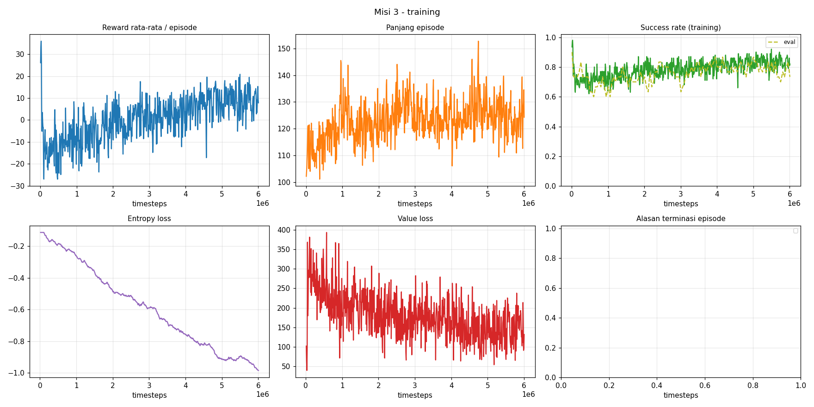

# curriculum_arm_rl

Curriculum reinforcement learning untuk lengan **UR10e 6-DoF + gripper** di **MuJoCo**: PPO (Stable-Baselines3) + IK,
tiga misi bertingkat (reaching → menyusuri jalur → menghindari rintangan), ekspor ke **ONNX**, dan **controller
hibrida RL + LQR** untuk presisi tingkat milimeter.

> **English summary.** Three-stage curriculum RL for a UR10e arm in MuJoCo (PPO + damped-least-squares IK, unified
> 57-d observation so weights transfer Mission 1 → 2 → 3). Mission 1: reaching with an adaptive success threshold;
> Mission 2: reach T1 then follow the straight line T1→T2; Mission 3: the same with obstacles and a difficulty
> curriculum. Policies export to ONNX. An optional hybrid layer (RL for coarse motion, LQR for precision, optional
> nose-to-path alignment) raises success at a 5 mm threshold from 4–7 % to 81–99 % without retraining. Documentation
> below is in Indonesian.



## Isi

- [Misi](#misi)
- [Hasil](#hasil)
- [Instalasi](#instalasi)
- [Mulai cepat](#mulai-cepat)
- [Controller hibrida (RL + LQR)](#controller-hibrida-rl--lqr)
- [Struktur proyek](#struktur-proyek)
- [Keputusan desain](#keputusan-desain)
- [Reproduksibilitas](#reproduksibilitas)
- [Batasan](#batasan)
- [Pemecahan masalah](#pemecahan-masalah)
- [Dokumen lain, lisensi, dan keamanan](#dokumen-lain-lisensi-dan-keamanan)

## Misi

Setiap misi dilatih terpisah (`python Mission<N>/train_mission<N>.py`, tanpa argumen CLI). Misi N+1 memuat bobot Misi N
lewat blok `transfer` di `ppo_config.yaml`.

| Misi | Tugas | Yang ditambahkan |
|---|---|---|
| 1 | Reaching ke target acak | Ambang sukses **adaptif**: naik ke level berikutnya bila success rate ≥ 85 %; hanya `reward_success` yang membesar, suku reward lain tetap |
| 2 | Reaching T1, lalu menyusuri **garis lurus T1 → T2** | Penalti cross-track `−w·d²` (d dibatasi 8 cm), penanda fase di observasi, panjang segmen 0,15–0,50 m |
| 3 | Seperti Misi 2, dengan **rintangan** | Konstelasi titik rintangan (terinspirasi konsep *stargaze*), shaping rintangan berbasis potensial, tabrakan = −100 dan episode berakhir, **kurikulum kesulitan** 5 level |

Aksi: 6 dimensi (3 delta posisi TCP maks 5 cm/langkah, 3 delta rotasi kerangka dunia maks 0,08 rad/langkah) → IK (damped
least squares) → target sendi → aktuator posisi MuJoCo. Langkah kontrol 20 ms (10 × 2 ms). Observasi **57 dimensi, sama
di semua misi** (dimensi yang belum relevan bernilai konstan).

## Hasil

Semua angka berasal dari model yang ada di `checkpoints/` dan `models/`. Satu seed per tahap; hasil training ulang bisa
berbeda (lihat [Reproduksibilitas](#reproduksibilitas)).

### Training (policy RL saja)

| Misi | Hasil | Catatan |
|---|---|---|
| 1 | success **95 %** di ambang 5 mm, jarak akhir rata-rata **4,5 mm** (evaluasi 20 episode) | level akhir tercapai pada ±1,77 juta langkah |
| 2 | success **100 %** (evaluasi 30 episode), cross-track ±21 mm | pada 100 skenario terpisah: 94–96 % (ambang 2 cm) |
| 3 | success **79,6 %** (95 % CI 76–83 %) pada 500 skenario terpisah, level akhir | baseline hasil transfer Misi 2 sebelum training Misi 3: 70,6 % |

Evaluasi 30 episode yang dipakai memilih `best_model` Misi 3 (86,7 %) bersifat optimistis; angka yang realistis ±80 %.
Kegagalan Misi 3 yang tersisa: tabrakan fase T1→T2 ≈ 9 %, timeout ≈ 7 % (berhenti 3–10 cm dari T1), self-collision ≈ 2 %.

### Dengan controller hibrida (100 skenario tetap, seed 20000+, level akhir untuk Misi 3)

Dijalankan oleh `Mission*/benchmark_hybrid_mission*.py` (angka dari mesin penulis). RL saja dilatih untuk ambang 2 cm, sehingga pada ambang 5 mm
hampir selalu timeout; controller memberi presisi yang tidak dimiliki RL.

| Misi | Ambang T1/T2 | RL saja | RL + LQR | RL + LQR + orientasi | Cross-track (RL saja → hibrida) |
|---|---|---|---|---|---|
| 3 | 2 cm | 80,0 % | 87,0 % | 89,0 % | 26,5 → 1,5 mm |
| 3 | 5 mm | 4,0 % | 81,0 % | 85,0 % | 21,4 → 1,0 mm |
| 2 | 2 cm | 96,0 % | 99,0 % | 99,0 % | 23,3 → 2,2 mm |
| 2 | 5 mm | 7,0 % | 99,0 % | 99,0 % | 26,8 → 1,5 mm |

Penyejajaran moncong gripper dengan jalur (hanya jalur menurun curam): galat moncong turun dari ±42° menjadi **6,5°**
(Misi 3) dan **3,3°** (Misi 2), tanpa menurunkan success. Controller **tidak** menghindari rintangan: tabrakan Misi 3 tetap ±10 %.

## Instalasi

```bash
python -m venv .venv && source .venv/bin/activate        # Python 3.10+ (diuji 3.12)
pip install -r requirements.txt
```

Diuji dengan: `mujoco 3.14`, `gymnasium 1.3`, `stable-baselines3 2.9`, `torch 2.14` (CPU), `numpy 2.4`, `onnx 1.23`,
`onnxruntime 1.24`, `tensorboard 2.21`. `requirements.txt` hanya memberi batas bawah; untuk hasil yang dapat diulang,
simpan `pip freeze` dari lingkungan Anda.

- GPU **tidak** diperlukan (MLP kecil; `device: cpu` di config lebih cepat).
- Diuji di **Linux** dan **WSL**. Windows native dan macOS belum diuji (macOS: viewer harus dijalankan dengan `mjpython`).
- Viewer membutuhkan layar; tanpa `DISPLAY` evaluasi otomatis berjalan *headless* (CSV dan plot tetap dibuat).
- Model **training** tidak memakai mesh; folder `robot_model/assets/` (±40 MB) hanya dibutuhkan untuk tampilan viewer.

## Mulai cepat

### A. Memakai model yang sudah dilatih (tanpa training)

`checkpoints/missionN/best_model.zip`, `best_vecnormalize.pkl`, dan `models/onnx_missionN_v1.onnx` sudah disertakan.

```bash
python Mission3/benchmark_hybrid_mission3.py     # RL saja vs hibrida, ambang 2 cm dan 5 mm (beberapa menit)
python Mission2/benchmark_hybrid_mission2.py
python Mission3/eval_mission3.py                 # evaluasi dengan MuJoCo viewer
```

### B. Melatih dari awal

```bash
python Mission1/train_mission1.py
python Mission2/train_mission2.py      # butuh checkpoints/mission1/best_model.zip + best_vecnormalize.pkl
python Mission3/train_mission3.py      # butuh checkpoints/mission2/best_model.zip + best_vecnormalize.pkl
tensorboard --logdir checkpoints
```

Waktu di mesin penulis (4 env, 6 juta langkah): Misi 2 ±2 jam dan Misi 3 ±2,5 jam. Setiap `train_missionN.py`
menjalankan: sanity check (IK, env, controller referensi) → training PPO dengan TensorBoard → `best_model` dan
`final_model` → ekspor ONNX berversi ke `models/onnx_missionN_vK.onnx` → `verify_onnx` pada observasi nyata → plot debug
di `checkpoints/missionN/debug/`.

- **Ctrl+C aman** (teruji): model terbaik tetap disimpan, ONNX diekspor dan diverifikasi. Tekan **sekali** lalu tunggu
  1–2 menit; pesan `BrokenPipeError` di akhir hanya noise saat menutup proses worker.
- **Belum ada fitur resume**: menjalankan ulang `train_missionN.py` memulai dari awal dan menimpa `best_model.zip`
  (ONNX tidak tertimpa, nomor versinya naik). Cadangkan `checkpoints/` lebih dulu.
- Jika checkpoint misi sebelumnya belum ada, Misi 2 dan 3 berhenti dengan pesan yang jelas sebelum training dimulai.

**Konfigurasi Misi 1.** Checkpoint Misi 1 yang disertakan dihasilkan dengan tangga ambang `[0.10, 0.05, 0.02, 0.005]`
(10 → 5 → 2 → 0,5 cm), `reward_success_multiplier: 1.5`, dan 6 juta langkah. Nilai di `Mission1/configs/ppo_config.yaml`
saat ini berbeda (7 level, pengali 1,2, 10 juta langkah). Untuk mereproduksi checkpoint, atur nilai pertama di atas.

### C. Evaluasi viewer

Pengaturan di `Mission*/configs/eval_config.yaml` (jumlah skenario, seed, ambang, ONNX yang dipakai). ONNX default
`latest` = versi tertinggi di `models/`; isi `paths.onnx_model` dengan path eksplisit untuk mengunci model.

## Controller hibrida (RL + LQR)

Model RL dipakai apa adanya (ONNX tidak berubah, tanpa training ulang). Controller LQR mengambil alih **posisi** TCP
saat gripper dalam 8 cm dari T1 atau saat fase T1→T2 dimulai; aksi rotasi tetap dari RL. Controller hanya membaca vektor
observasi 57 angka yang sama, sehingga dapat dideploy bersama ONNX.

```yaml
# Mission*/configs/eval_config.yaml
hybrid:
  enabled: true        # RL + LQR (posisi)
  orientation: true    # opsional: sejajarkan moncong dengan jalur (hanya jalur menurun curam)
```

Saat aktif, terminal mencetak `[eval] mode HIBRIDA: ...`; bila baris itu tidak muncul, evaluasi memakai RL saja.
Parameter ada di `shared/control/controller.yaml`. Untuk ambang presisi, set `rollout.t1_reach_threshold` dan
`rollout.success_pos_threshold` ke `0.005`.

Deploy di luar proyek:

```python
from shared.control import make_hybrid_from_onnx
policy = make_hybrid_from_onnx("models/onnx_mission3_v1.onnx")   # parameter: shared/control/controller.yaml
policy.reset()                  # WAJIB di awal tiap episode (controller menyimpan riwayat posisi)
action = policy(obs_mentah)     # observasi mentah 57-dim; normalisasi sudah ada di dalam ONNX
```

Catatan penting:
- Penyejajaran moncong hanya untuk jalur **menurun curam** (< 60° dari "lurus ke bawah"). Pada jalur mendatar/menanjak,
  penyejajaran menurunkan success 11–18 poin (self-collision, kontak lantai), jadi tidak diaktifkan.
- Saat orientasi aktif, batas kerucut orientasi env (30°) dilonggarkan (`policy.cone_request`; ditangani `bind_to_env`).
  Pada robot nyata, antarmuka perintah harus menerima rentang orientasi lebih lebar pada tahap itu.
- `max_pos_delta` dan `max_rot_delta` di `controller.yaml` harus sama dengan config env (benchmark memeriksanya).

Detail, hasil, dan batasan: [`KONTROL_HIBRIDA.md`](KONTROL_HIBRIDA.md).

## Struktur proyek

```
Mission1|2|3/
  envs/                  env training (Stage1ReachEnv, Stage2PathEnv, Stage3ObstacleEnv)
  eval_envs/             subclass env training + scene_eval.xml (observasi identik dengan training)
  configs/               ppo_config.yaml · domain_randomization.yaml (config env) · eval_config.yaml
  debug/                 plot khusus misi (threshold sweep / cross-track / clearance rintangan)
  train_missionN.py      entry point training
  eval_missionN.py       entry point evaluasi (viewer)
  benchmark_hybrid_missionN.py   uji RL saja vs hibrida (Misi 2 dan 3)
shared/
  envs/                  BaseArmEnv, obs_layout (observasi 57-dim), robot_geometry (kapsul), validation, path_task
  training/              trainer generik, callbacks (adaptive, kurikulum kesulitan, best-model, warm-up critic), transfer
  evaluation/            evaluasi viewer + marker T1/T2/garis/rintangan
  exporter/              to_onnx (berversi), verify_onnx
  debug_common/          rollout, sanity check, plot, pembaca TensorBoard
  control/               controller LQR, controller orientasi, policy hibrida, benchmark
ik/                      IK damped-least-squares + util pose
obstacles/               generator konstelasi rintangan (+ visualizer)
robot_model/             ur10e_train.xml / ur10e_eval.xml / scene_*.xml / assets (mesh)
checkpoints/             keluaran training per misi (model terbaik, plot debug, log evaluasi)
models/                  ONNX hasil ekspor (onnx_missionN_vK.onnx + .json metadata)
```

Semua parameter ada di YAML.

## Keputusan desain

- **Observasi terpadu 57-dim** (`shared/envs/obs_layout.py`): rel_target, q, qd, tcp_pos, tcp_rot6, manip, prev_action,
  time_left, phase, path_dir, cross_track_vec, path_progress, obs_rel, obs_dist, min_clearance. Dimensi yang belum aktif
  tetap konstan; derau sensor hanya diberikan pada dimensi aktif (dimensi nonaktif berderau menjadi N(0,1) acak setelah
  normalisasi dan merusak transfer).
- **Transfer yang tidak merusak policy** (`shared/training/transfer.py`): tanpa perlindungan, fine-tuning Misi 2
  menjatuhkan success dari 75 % ke 0 % dalam 25k langkah. Penyebabnya statistik normalisasi yang bergeser dan critic baru
  yang masih acak. Perlindungan: bobot input fitur baru di-nol-kan, statistik normalisasi dibekukan (dimensi baru diisi
  dari rollout nyata), `log_std` dipertahankan, dan **critic dilatih lebih dulu** dengan actor dibekukan (100–150k langkah).
- **Kompensasi gravitasi** (`gravcomp`) pada semua body, dengan domain randomization (payload 0–1 kg, gravitasi ±2 %).
  Tanpa kompensasi, ambang 5 mm tidak tercapai.
- **Validasi skenario saat reset**: target dan jalur harus dapat dijangkau IK yang sama dan bebas kontak (jalur lurus atau
  polar mengitari base untuk fase home → T1).
- **Rintangan** (Misi 3): clearance dihitung dari 10 kapsul badan robot, bukan titik origin link. Konstelasi dibangkitkan
  di sekitar T2 (nukleus), T1 dipilih pada face terluar kubus (konstelasi L = 0,1 / 0,2 / 0,3 m, rintangan bola radius
  1,5 cm). Rintangan yang terlalu dekat dengan jalur referensi dipangkas.
- **Kurikulum kesulitan Misi 3** (`DifficultyCurriculumCallback`): naik satu level bila success ≥ 80 %. Tiga hal yang
  diketatkan bertahap: margin koridor lintasan (12 → 1 cm), margin pendekatan (20 → 15 cm), dan batas jangkau T1.
  **Margin pendekatan 15 cm di level akhir adalah bagian dari definisi tugas**: jalur alami policy menyimpang 5–20 cm
  dari jalur referensi dan tidak dapat diamati, sehingga rintangan lebih dekat dari itu menimbulkan tabrakan fase
  pendekatan yang tak terhindarkan.
- **Shaping rintangan berbasis potensial** `F = γΦ(s') − Φ(s)`: penalti per langkah membuat policy memilih diam
  (timeout 18 % → 69 % saat koridor dilebarkan).
- **Pemilihan `best_model`**: berdasarkan (level kurikulum, success rate, ketelitian), dengan skenario evaluasi tetap dan
  evaluasi policy awal sebagai baseline. Mean reward tidak dipakai karena skalanya berubah saat kurikulum naik.

## Reproduksibilitas

- Dengan seed dan setup yang sama pada satu mesin, hasil training dapat diulang persis (diverifikasi bit-per-bit; `SubprocVecEnv`
  dan `DummyVecEnv` identik). Perubahan `torch_num_threads` (1 → 4) mengubah hasil.
- Antar mesin (diuji pada dua mesin), benchmark evaluasi memberi angka utama yang sama atau berbeda 1–2 poin
  (97–99 dari 100 skenario berhasil identik).
- Training ulang dari awal bisa menghasilkan hasil sedikit berbeda; sebaran antar seed belum diukur. Rantai Misi 1 → 2 → 3
  mewariskan perbedaan itu. Untuk hasil yang sama, pakai checkpoint yang disertakan.
- Pertahankan `torch_num_threads: 1` dan `n_envs: 4` untuk meniru setup penulis.

## Batasan

- **Controller hibrida tidak menghindari rintangan.** Tabrakan Misi 3 ≈ 10 %.
- Penyejajaran moncong hanya untuk jalur menurun curam; pada jalur lain moncong tetap miring ±24° dari vertikal (policy
  mempelajari kemiringan itu di Misi 1 dan sangat bergantung padanya; tanpa rotasi, success jatuh ke 0 %).
- Garis lurus ke T1 gagal pada skenario berjalur polar (≈ seperlima skenario), jadi controller tidak menggantikan RL pada
  pendekatan jauh.
- Belum diuji: Windows native, macOS, jendela viewer interaktif dengan mode hibrida, derau sensor nyata, hardware nyata,
  dan model selain yang disertakan. Derau sensor besar membuat aktuator bergetar (filter belum dibuat).
- Satu seed per tahap; sebaran hasil training belum diukur.

## Pemecahan masalah

| Gejala | Penyebab / solusi |
|---|---|
| `could not initialize GLFW` / viewer tidak terbuka | Tidak ada layar. Evaluasi otomatis headless; atau jalankan dengan `DISPLAY` (macOS: `mjpython`) |
| Misi 2/3 berhenti dengan `... tetapi file belum ada: ...` | Latih misi sebelumnya dulu, atau pakai checkpoint yang disertakan |
| Angka benchmark jauh berbeda dari tabel | Cek nama ONNX di baris pertama output (`latest` bisa memilih versi lebih baru), `n_envs`, `torch_num_threads`, dan config yang diubah |
| `ValueError: max_pos_delta env != controller.yaml` | Samakan `max_pos_delta`/`max_rot_delta` di `controller.yaml` dengan config env |
| `Belum ada onnx_missionN_v*.onnx di ...` pada evaluasi/benchmark | Jalankan `train_missionN.py` atau salin ONNX ke `models/` |
| Hasil training ulang berbeda | Wajar; lihat [Reproduksibilitas](#reproduksibilitas) |

## Dokumen lain, lisensi, dan keamanan

- [`KONTROL_HIBRIDA.md`](KONTROL_HIBRIDA.md): controller hibrida, pengukuran, dan batasan.
- [`LAPORAN_PERUBAHAN.md`](LAPORAN_PERUBAHAN.md): audit kode awal dan bug yang diperbaiki (dokumen historis).
- [`robot_model/assets/README.md`](robot_model/assets/README.md): daftar mesh dan sumbernya.

**Lisensi.** Kode dan gripper dirilis di bawah [lisensi MIT](LICENSE). Mesh UR10e dari MuJoCo Menagerie tetap
memakai lisensinya sendiri (lihat Atribusi).

**Atribusi.** Mesh lengan UR10e dan model dasarnya berasal dari
[MuJoCo Menagerie](https://github.com/google-deepmind/mujoco_menagerie) (`universal_robots_ur10e`); lisensinya mengikuti
berkas `LICENSE` di sana (lihat [`robot_model/assets/README.md`](robot_model/assets/README.md)). Gripper dirancang sendiri oleh
pemilik repo dan mengikuti lisensi kode di atas.

**Keamanan.** `best_vecnormalize.pkl` dan `*.zip` dari Stable-Baselines3 memakai `pickle`; **muat hanya dari sumber yang
Anda percaya**. ONNX berformat protobuf dan tidak memakai `pickle`.
